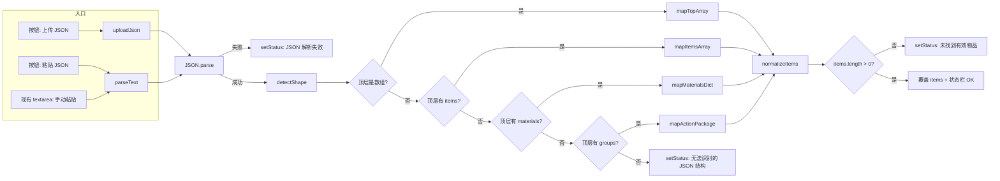
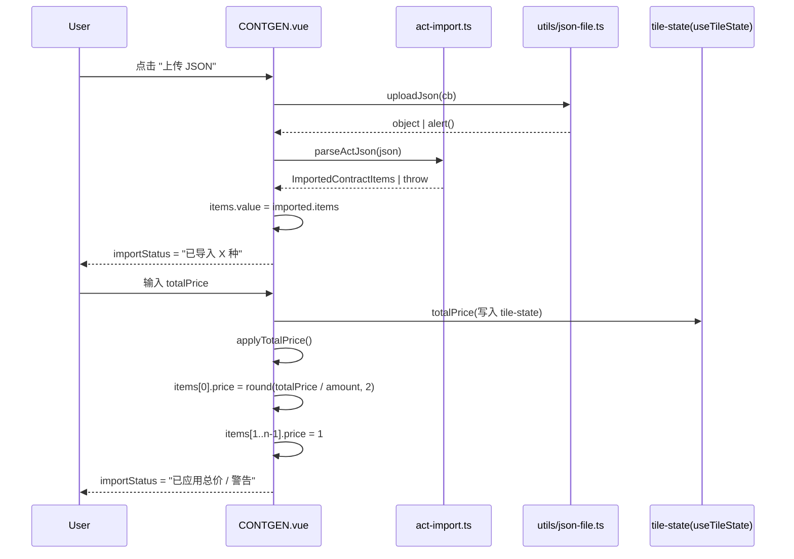

# CART + CONTGEN 整合方案：ACT JSON 导入 & 购买/出售总价设置

> 目标：为 CONTGEN 增加"识别 ACT JSON 脚本"能力，并为其 BUY/SELL 模板新增"总价"快捷设置。
> 模块：`src/features/XIT/CART/*`、`src/features/XIT/CONTGEN/*`、`src/utils/json-file.ts`。

---

## 1. 现状摘要（与方案紧密相关）

| 关注点 | 当前实现 | 出处 |
| --- | --- | --- |
| **ACT JSON 解析** | `parseCartImport(source)` 递归扫描 `global.name` / `materials` / `groups[*].materials` / 单个 `{ticker,amount}` 行 / `actions[*].exchange|origin` 推断交易所；输出 `{name, exchange, items: CartItem[]}`。 | [cart-utils.ts:73-117](file:///c:/Users/kilsa/Desktop/code/%E7%90%BC%E6%9D%B0/RUNCN/src/features/XIT/CART/cart-utils.ts#L73-L117) |
| **购物车条目结构** | `UserData.CartItem = {ticker, amount}`，**没有 price 字段**。 | [user-data.types.d.ts:51-60](file:///c:/Users/kilsa/Desktop/code/%E7%90%BC%E6%9D%B0/RUNCN/src/store/user-data.types.d.ts#L51-L60) |
| **ACT 自动填充** | `contd-auto-fill.ts` 已实现"JSON 配置"面板，验证规则见 `validateConfig` —— BUY/SELL 每行需有 `price`，**TOP-LEVEL `price` 仅当 SHIP 必填**；BUY/SELL 中 top-level price 仅充当缺省值。 | [contd-auto-fill.ts:874-963](file:///c:/Users/kilsa/Desktop/code/%E7%90%BC%E6%9D%B0/RUNCN/src/features/basic/contd-auto-fill.ts#L874-L963) |
| **CONTGEN 输出结构** | `ContractJson = {template, currency, name?, location?|origin?+destination?, price?, deadline?, items: [{commodity, amount, price?}, ...]}`；其中 `it.price` 是 **per-row 单价**，`price`（顶层）只在 SHIP 共享运费时被使用。 | [CONTGEN.vue:23-152](file:///c:/Users/kilsa/Desktop/code/%E7%90%BC%E6%9D%B0/RUNCN/src/features/XIT/CONTGEN/CONTGEN.vue#L23-L152) |
| **CONTGEN → CONTD 桥** | `newContractDraftAndFill(outputJson)` 把 JSON 写入 tile-state workspace key `contgen-output`，然后打开/聚焦 CONTD 列表面板，点击 `新建`，监听 `contractDraftsStore` 拿到新的 naturalId，再 `UI_TILES_CHANGE_COMMAND` 切换到详细视图触发 `contd-auto-fill` 的自动填表。 | [new-and-fill.ts:1-162](file:///c:/Users/kilsa/Desktop/code/%E7%90%BC%E6%9D%B0/RUNCN/src/features/XIT/CONTGEN/new-and-fill.ts#L1-L162) |
| **CONTD 接受契约** | BUY/SELL 时 `validateConfig` 检查 `items[i].price ?? cfg.price`，二者至少有一；SHARP 单价不允许、但 pricePerUnit 字段存在于表单 `<input name="trades[i].pricePerUnit">` 上。 | [contd-auto-fill.ts:886-916](file:///c:/Users/kilsa/Desktop/code/%E7%90%BC%E6%9D%B0/RUNCN/src/features/basic/contd-auto-fill.ts#L886-L916) |
| **上传 JSON 工具** | `uploadJson(callback)`：创建隐藏 `<input type="file" accept=".json">`，`FileReader.readAsText` 后 `JSON.parse` 回调，错误时 `alert`。 | [json-file.ts:13-46](file:///c:/Users/kilsa/Desktop/code/%E7%90%BC%E6%9D%B0/RUNCN/src/utils/json-file.ts#L13-L46) |
| **代码风格** | 中文 user-facing 文案；Vue script setup + `<style module>`；feature 通过 `xit.add({ command, name, description, component })` 注册；状态由 `useTileState('key', default)` 绑定到当前 tile ID。 | [CONTGEN.ts:1-9](file:///c:/Users/kilsa/Desktop/code/%E7%90%BC%E6%9D%B0/RUNCN/src/features/XIT/CONTGEN/CONTGEN.ts#L1-L9) [feature-patterns.md#Adding-an-XIT-Command](file:///c:/Users/kilsa/Desktop/code/%E7%90%BC%E6%9D%B0/RUNCN/docs/feature-patterns.md) |

---

## 2. 需求拆解与决策点

### 2.1 决策点 D1：复用 CART 的解析器还是新建？
**结论：复用 `parseCartImport` 的核心递归，但不直接复用其"推断交易所+丢空行"的语义**，原因是：
- CART 解析后只剩 `(ticker, amount)`，**price 信息被丢弃**。本需求要 price 流向 CONTGEN 的 BUY/SELL 行，丢失后无法还原。
- CART 的 items 是 `CartItem`，未携带价格字段；扩展 `CartItem` 会影响 `buildActionPackage` 与持久化迁移，得不偿失。
- CONTGEN 输出格式是 `items: [{commodity, amount, price?}]`，**字段名是 commodity 而不是 ticker**。

→ **新增独立模块 `src/features/XIT/CONTGEN/act-import.ts`**，把 CART 的递归 + 标准化原语（`normalizeTicker` / `normalizeAmount`）整体借鉴；输出 `ImportedContractItems`。

### 2.2 决策点 D2：ACT JSON "items" 怎么识别？
**结论：定义一套三层探测链**，与 CART 同源但更严格：
1. **顶层数组形态 `[{ticker,amount,price?}, ...]` 或 `[{material,amount,price?}, ...]`** —— 最常见（PrUn Operator / 社区脚本导出的"物品清单"形态）。
2. **顶层对象 `{items: [...]}` 或 `{materials: {...}}`** —— BUY/SELL 契约 JSON 形态；只吸收 `items` / `materials` 字段，忽略 `template/currency/location`。
3. **ACT 操作包形态 `{groups:[{materials:{...}}, ...]}`** —— 来自 `buildActionPackage` 或 `XIT ACT` 导出；吸收每一行 group 的 `materials` 字典（amount 提取为字典 value，**price 留空**——因为 ACT 操作包不存单价）。

> 不去推断 `exchange/currency/template` —— 这些由用户通过 CONTGEN 表单继续选择，避免脚本里写错。

### 2.3 决策点 D3：物品清单和已填字段如何并存？
**结论：导入 = 覆盖 `items`，其它字段（template/currency/location/origin/destination/deadline/name）保持不变**。理由：
- 同一 tile 上可能用户已经选过模板/目的地，覆写模板会造成更大割裂感。
- 用户大概率会用同一个模板补"我自己的目的地"。

### 2.4 决策点 D4（功能 2）：BUY/SELL 的"总价"语义
需求原文逐字解读：

> - 清单中首个物品的价格应设置为总价（注意：此为总价而非单价）
> - 若首个物品存在多个数量，需根据数量进行相应计算（总价 = 单价 × 数量）
> - 清单中除首个物品外的所有其他物品，单价统一设置为 1
> - 确保价格计算逻辑准确无误，总价与各物品价格总和保持一致

设：总价 `T`；清单 `items[0..n-1]`，每个 `items[i] = {commodity, amount, price?}`。

| 项 | 算法 | 校验 |
| --- | --- | --- |
| `items[0].price` | `T / items[0].amount` | `T % items[0].amount === 0`；否则价格必须保留 ≥2 位小数并向下取整到 `0.01`，同时在状态栏提示"总价不可整除，单价已四舍五入到 0.01"。 |
| `items[1..n-1].price` | `1`（不论 amount） | — |
| 一致性 | `Σ items[i].amount × items[i].price` 是否等于 `T`？由于 `items[0]` 单价计算后 `Σ amount × price = T + (n-2+1)×1 = T + (n-1)`。需求文本明确指出"单价统一设置为 1"——这**与"总价与各物品价格总和保持一致"的目标相矛盾**，除非只有 1 个物品或物品数为 0。 | 见 §6.2.4 兼容性提示 |

**关于数值精度的细节**：PrUn 价格是 2 位小数货币；CART `normalizeAmount` 用 `Math.ceil`。CONTGEN 当前 `output` 直接用 `Number(item.price)`，但 `validateConfig` 检查 `rowPrice >= 0 && isFinite`。最终结果四舍五入到 2 位小数并向下取整，避免 `0.30000000000000004` 之类。

### 2.5 决策点 D5：UI 触发位置
- **JSON 导入**：在 ActionBar 增加 `导入 JSON` 与 `上传 JSON` 两个 PrunButton，并在表单区显示识别统计（X 种 / Y 件 / Z 总价）。文案沿用 CART `CART.vue:328-340` 的"识别 XIT JSON"模式。
- **总价字段**：仅 BUY/SELL 模板时显示；放到"物品清单"标题旁，与 +/- 添加行按钮共用一行。值字段类型 `number`，`<input type="number" step="0.01" min="0">`。

---

## 3. 功能流程图

### 3.1 总流程（端到端）

```mermaid
flowchart TD
    A[用户在 CONTGEN 面板操作] --> B{动作类型}
    B -->|导入 ACT JSON| C[act-import 流程 §3.2]
    B -->|设置总价| D[总价拆分算法 §3.3]
    B -->|点击"新建合同并填充"| E[现有 newContractDraftAndFill 不变]

    C --> C1[解析 JSON]
    C1 --> C2{格式校验}
    C2 -->|通过| C3[覆盖 items + 显示统计]
    C2 -->|失败| C4[状态栏红字报错]
    C3 --> F[output computed 重算]
    C4 --> F

    D --> D1[读取 totalPrice & items]
    D1 --> D2{首个物品存在?}
    D2 -->|否| D3[状态栏提示 无物品]
    D2 -->|是| D4[计算单价 = totalPrice / amount]
    D4 --> D5{可整除?}
    D5 -->|是| D6[直接写入]
    D5 -->|否| D7[四舍五入到 2 位 + 警告]
    D6 --> D8[其余行 price = 1]
    D7 --> D8
    D8 --> F

    F --> G[JSON 预览重渲染]
    G --> H{用户点击 新建并填充}
    H -->|是| E
    H -->|否| I[用户继续编辑]
```

### 3.2 ACT JSON 导入子流程



### 3.3 总价拆分算法

```mermaid
flowchart TD
    SP[用户输入 totalPrice] --> W[watch totalPrice 变化]
    W --> Q{template == BUY/SELL?}
    Q -->|否| X[不响应 - 仅警告用户清空]
    Q -->|是| CHK{items.length 有效?}
    CHK -->|否| E1[setStatus: 先添加至少一个物品]
    CHK -->|是| SORT[按"现顺序"处理 items 0..n-1]
    SORT --> CALC
    subgraph CALC[单价计算]
        C1[items 0: unit = totalPrice / items 0.amount]
        C1 --> C2{小数位 == 0?}
        C2 -->|是| C3[直接赋值]
        C2 -->|否| C4[四舍五入到 0.01 + setStatus 警告]
        C3 --> C5[其余 items i=1..n-1: price = 1]
        C4 --> C5
    end
    CALC --> OK[output JSON 自动刷新]
```

---

## 4. 模块交互设计

### 4.1 文件改动清单

| 文件 | 类型 | 说明 |
| --- | --- | --- |
| `src/features/XIT/CONTGEN/act-import.ts` | **新建** | `parseActJson(source)` + `validateActJson(source)` + 类型 `ImportedContractItems`。复用 CART 的 `normalizeTicker` / `normalizeAmount` 思路；不导入 CART 模块文件以避免循环依赖。 |
| `src/features/XIT/CONTGEN/CONTGEN.vue` | 修改 | 加 `importText`、`importStatus`、`totalPrice` 三个 ref；加 ActionBar 按钮 `<PrunButton primary @click="onImportClick">导入 JSON</PrunButton>` 与 `<PrunButton primary @click="onUploadClick">上传 JSON</PrunButton>`；在物品清单标题行 BUY/SELL 分支加总价 `<input>`。挂 `watch` 触发 §3.3 算法。 |
| `src/features/XIT/CONTGEN/CONTGEN.vue` 样式 | 修改 | `.itemTotalRow` / `.importStatus` / `.itemPrice` 局部样式。 |
| `src/infrastructure/prun-api/data/user-data.types.d.ts` | **不改** | 不动 `CartItem`；新增的 price 字段只活在 CONTGEN 内存中的 `Item[]`。 |

### 4.2 CONTGEN.vue 内部状态（新增）

```ts
// 仅 BUY/SELL 模板时有效。SHIP 不消费这个值。
const totalPrice = useTileState<number | undefined>('totalPrice', undefined);

// JSON 导入的临时状态（不持久化）
const importText = ref('');
const importStatus = ref<{ kind: 'ok' | 'warn' | 'err'; message: string } | null>(null);
```

> `totalPrice` 用 `useTileState` 走 tile ID，自动落到 `userData.tileState[tileId].totalPrice`，关闭再开会保留；`importText` / `importStatus` 不需要持久化。

### 4.3 CONTGEN.vue 模板布局（新增）

```vue
<!-- ActionBar 追加 -->
<PrunButton primary :disabled="isBusy" @click="onImportClick">导入 JSON</PrunButton>
<PrunButton primary :disabled="isBusy" @click="onUploadClick">上传 JSON</PrunButton>

<!-- 新增导入行（与现有表单整合；不影响 BUY/SELL/SHIP 分支结构）-->
<Active v-if="importStatus" label="导入状态">
  <span :class="importStatusClass">{{ importStatus.message }}</span>
</Active>
<Active label="识别 XIT JSON" tooltip="粘贴 ACT JSON 或 {COF:100} 这样的清单">
  <textarea v-model="importText" :class="[$style.input, $style.jsonArea]" spellcheck="false" />
</Active>

<!-- 物品清单 - BUY/SELL 时的总价行 -->
<Active v-if="isBuyOrSell" label="总价" tooltip="将总价拆分到首行单价；其余行单价统一为 1">
  <input
    v-model.number="totalPrice"
    type="number"
    min="0"
    step="0.01"
    :class="$style.input"
    placeholder="0.00"
    @change="applyTotalPrice" />
  <PrunButton dark :disabled="!canApplyTotal" @click="applyTotalPrice">应用总价</PrunButton>
</Active>
```

### 4.4 模块数据流



---

## 5. 数据结构与类型

### 5.1 `UserData.Item`（CONTGEN 内部，仅在 .vue 文件中）

```ts
interface Item {
  ticker: string;
  amount: number;
  price?: number; // per-row 单价；UI 上对 BUY/SELL 必有；SHIP 无此概念
}
```

> 沿用现有定义；不改 `user-data.types.d.ts`。

### 5.2 新增 `act-import.ts` 类型

```ts
export interface ImportedRow {
  ticker: string;     // 大写、与 materialsStore ticker 对齐
  amount: number;     // 正整数（向上取整）
  price?: number;     // 来自源 JSON；ACT 操作包形态可能缺
}

export interface ImportedContractItems {
  rows: ImportedRow[];
  // 调试/反馈用；不是对契约本身的承诺
  source: 'array' | 'items' | 'materials' | 'actionPackage' | 'mixed';
  // 用于 UI 反馈：解析过程发现的统计
  stats: { unique: number; totalUnits: number; withPrice: number };
}
```

### 5.3 输入 JSON 形态示例（与前端处理分支对齐）

| 形态 | 来源 | 示例 |
| --- | --- | --- |
| 顶层数组 | 社区脚本粘贴 | `[{ "ticker": "COF", "amount": 100 }, {"ticker":"RAT","amount":50}]` |
| `items` 数组（CONTGEN 自身输出） | 用户重新导入 | `{ "template":"BUY", "items":[{"commodity":"COF","amount":100,"price":12}] }` |
| `materials` 字典（CART/ACT 导出） | `XIT CART` | `{ "materials": {"COF": 100, "RAT": 50} }` |
| `groups[*].materials` | `XIT ACT` 导出 | `{ "global":{"name":"Cart"}, "groups":[{"type":"Manual","materials":{"COF":100}}] }` |
| ticker 顶层字典 | 自由形态 | `{ "COF": 100 }` |

### 5.4 关键算法伪代码（总价拆分）

```ts
function applyTotalPrice() {
  if (!isBuyOrSell.value) return;          // 只 BUY/SELL
  if (items.value.length === 0) {          // 空清单：报错
    setStatus('请先添加至少一个物品。', 'err');
    return;
  }
  const total = Number(totalPrice.value);
  if (!Number.isFinite(total) || total < 0) {
    setStatus('请输入有效的总价。', 'err');
    return;
  }
  const first = items.value[0];
  const amount = Math.max(1, Math.ceil(first.amount));
  const unit = computeUnit(total, amount);
  first.price = unit;

  // 其余行单价统一为 1；不修改 amount
  for (let i = 1; i < items.value.length; i++) {
    items.value[i].price = 1;
  }

  // 总价 / 总金额 一致性提示（仅当多个物品时给警告——见 §6.2.4）
  const sum = items.value.reduce(
    (s, it) => s + (it.amount ?? 0) * (it.price ?? 0),
    0,
  );
  const msg =
    items.value.length === 1
      ? `已应用总价 ${total}：单价 ${fixed02(unit)}`
      : `已应用总价 ${total}；首行单价 ${fixed02(unit)}，其余单价 1，合计 ${fixed02(sum)}`;
  setStatus(msg, items.value.length > 1 ? 'warn' : 'ok');
}

function computeUnit(total: number, amount: number): number {
  const raw = total / amount;
  if (Number.isInteger(raw)) return raw;
  // 向下到 0.01 步长，避免浮点尾差
  return Math.round(raw * 100) / 100;
}
```

### 5.5 关键算法伪代码（ACT JSON 探测）

```ts
export function parseActJson(source: unknown): ImportedContractItems {
  const rows: ImportedRow[] = [];
  let sourceTag: ImportedContractItems['source'] = 'mixed';

  if (Array.isArray(source)) {
    rows.push(...mapTopArray(source));
    sourceTag = 'array';
  } else if (isObject(source)) {
    if (Array.isArray(source.items)) {
      rows.push(...mapItemsArray(source.items));
      sourceTag = 'items';
    } else if (isObject(source.materials)) {
      rows.push(...mapMaterialsDict(source.materials));
      sourceTag = 'materials';
    } else if (Array.isArray(source.groups)) {
      for (const g of source.groups) {
        if (isObject(g) && isObject(g.materials)) {
          rows.push(...mapMaterialsDict(g.materials));
        }
      }
      sourceTag = 'actionPackage';
    } else {
      // 顶层 ticker 字典 — 仅吸收看起来像 ticker 的 key
      for (const [k, v] of Object.entries(source)) {
        const ticker = normalizeTicker(k);
        const amount = normalizeAmount(v);
        if (ticker && amount !== undefined) rows.push({ ticker, amount });
      }
      sourceTag = 'mixed';
    }
  } else {
    throw new Error('无法识别的 JSON 结构');
  }

  const normalized = normalizeAndDedup(rows);
  if (normalized.length === 0) throw new Error('未找到有效物品');

  return {
    rows: normalized,
    source: sourceTag,
    stats: {
      unique: normalized.length,
      totalUnits: normalized.reduce((s, r) => s + r.amount, 0),
      withPrice: normalized.filter(r => typeof r.price === 'number').length,
    },
  };
}
```

---

## 6. 兼容性、影响评估与边界

### 6.1 与现有功能的关系

| 现有功能 | 改动 | 影响 |
| --- | --- | --- |
| `parseCartImport` | 不动 | 复用同名规则的精神；不复用实现 |
| `buildActionPackage` | 不动 | CONTINUE——我们把 ACT JSON 导入到 CONTGEN 后，还是走"新建合同并填充"路径落到 CONTD，不会和 CART 拼装 ACT 包产生冲突 |
| `newContractDraftAndFill` | 不动 | 总价拆分后产出的 JSON 仍满足 `validateConfig`（BUY/SELL 每行有 price） |
| `validateConfig`（CONTD 一侧） | 不动 | 强约束；UI 上不能跳过 warning 后还提交 |
| 现有 `output` computed | 加一个 `watch(totalPrice)` 即可，不需要把 totalPrice 编进 output JSON（避免污染对外契约）| 输出 JSON 仍按 per-row 单价走 |
| `useTileState` keyspace | 新增 `'totalPrice'` key | 现有 tile 不会迁移；删 tile 自动清理（`useTileState` 在持久 + 空对象时 `delete state[key]`）|

### 6.2 边界与已知约束

1. **精度**：PrUn 单价 2 位小数；`computeUnit` 用 `Math.round(raw * 100) / 100`，避免 `0.30000000000000004`。
2. **空清单**：导入 / 总价都必须先有至少一行；UI 上明确禁用按钮或写状态栏红字。
3. **空 `price` 的导入行**：BUY/SELL 的 `validateConfig` 不允许，没填的会被现有 `validationErrors` 拦截；UI 上以状态栏红字提示"X 行缺单价"，并把光标定位到第一行缺单价的 row。
4. **首物品数量为 0**：禁止（与现有 `Item.amount` 校验一致：`Math.max(1, …)`）。
5. **总额与单价总和"相等"语义**：见 §2.4 D4 表格末行——需求文本同时要求"其余单价 = 1"与"总额 = 单价总和"，仅在以下两种自然情形满足：
   - 仅 1 个物品 → 自然满足；
   - 物品数 = 2 且 items[0].amount = 2 且总价为 2*unit + 1 → 巧合满足；
   
   其余情形都会"差额 = (n-1)"。**方案行为**：照需求设置 items[1..n-1].price = 1，并在状态栏用 `warn` 级文本提示"合计不等于总价"，让用户知情。这与 `SOUL.md` 第 1 条"显式说出取舍"契合。

### 6.3 输入校验失败处理

| 失败点 | 反馈 |
| --- | --- |
| `JSON.parse` 抛异常 | `importStatus = { kind:'err', message:'JSON 解析失败' }` |
| 顶层既不是数组也不是对象 | `无法识别的 JSON 结构` |
| 解析后 `rows.length === 0` | `未找到有效物品` |
| 行 `ticker` 通过 `normalizeTicker` 后丢失 | 静默丢弃 + 在统计中显示"丢弃 X 行" |
| 行 `amount <= 0` | 同上 |
| BUY/SELL 任何行缺 `price` | 现有 `validationErrors` 报错（不变），并在 `importStatus` 补充 `其中 X 行带单价` |

### 6.4 不在范围内

- 不修改 `UserData.CartItem` 类型（避免持久化迁移）。
- 不写顶层 `price` 到 ContractJson（避免与 SHIP 冲突）。
- 不改动 `newContractDraftAndFill`（下游链路已经验证过）。
- 不修改 `contd-auto-fill.ts` 的 `validateConfig`（已经足够严格，新需求只要保证 JSON 过得了即可）。

---

## 7. 实现步骤（按依赖顺序）

| # | 步骤 | 验证 |
| --- | --- | --- |
| 1 | 新建 `src/features/XIT/CONTGEN/act-import.ts`，实现 `parseActJson` + 5 类形态识别 + 规范化。 | 写一组单元测试式手测：粘贴 5 种 JSON，能稳定给出 `rows[]`。 |
| 2 | 在 `CONTGEN.vue` 加 `importText` / `importStatus` / `totalPrice` 三个 ref 与 `applyImportedItems(json)` / `applyTotalPrice()` 函数。 | 手测：导入已成功覆盖 items；总价拆分后第一行单价正确，其余行为 1。 |
| 3 | 改 ActionBar + 新增导入行 UI。 | 在浏览器刷新后看到按钮；点击「上传 JSON」弹出文件选择器。 |
| 4 | 在 BUY/SELL 物品清单标题行插入「总价」输入框。 | 切到 SHIP 时该字段不显示。 |
| 5 | 加 `watch(totalPrice)` 自动触发拆分（额外加显式按钮以便用户回看）。 | 输入 12.34 时立即看到 items[0].price = 12.34 （amount=1）；输入 10 / amount=3 时显示警告且单价 = 3.33。 |
| 6 | 走通端到端：导入 JSON → 调整总价 → 切到 SHIP（应清空总价字段？见 §6.5 决策）→ 切回 BUY → 改为 BUY → 「新建合同并填充」成功落到 CONTD。 | UI 录屏或手动验证；最终 `validateConfig` 应通过。 |
| 7 | 顺手把 `output` computed 里"所有行都有 price" 的判断也覆盖到手动导入后的场景。 | `validationErrors` 在导入缺价时不空。 |

### 7.1 §6.5 决策：模板切换时 `totalPrice` 怎么处理？
- SHIP 模板不需要总价字段，但 `totalPrice` 仍可留作后续切回 BUY 用。
- 模板从 BUY/SELL 切到 SHIP：不主动清空（用户可能只是想看一眼运费再切回去）；但 UI 把总价输入框隐藏。
- 模板从 SHIP 切到 BUY/SELL：保留 totalPrice，原 items[0].price / items[1..n-1].price 不动，等用户主动再点"应用总价"或修改数值时再触发拆分。

---

## 8. 主要风险与缓解

| 风险 | 缓解 |
| --- | --- |
| `tiles.observe` 撞到模板切换导致 tile-state 旧值残留 | `useTileState` 已自带空对象清理；UI 主动 watch 模板变化时 `setStatus('总价已隐藏')` 即可。 |
| 浮点价格导致 `validateConfig` 拒 | 用 `Math.round(x*100)/100` 后再 `Math.abs(delta)<0.005` 自检；通过则保留，否则用 0.01 兜底。 |
| JSON 导入覆盖掉了用户已经在 items 里手填的单价 | 状态栏用 `warn` 级提示"已覆盖 X 个手填行"，并在按钮 hover 时显示详情。 |
| `importText` 永远不持久化，浏览器刷新就丢 | 故意为之——上传 / 粘贴是单次动作；但 textarea 文本可双击复制回去。 |
| 总价拆分后多个物品合计 ≠ 总价 | 显式 warn 文案，遵循 §2.4 D4 要求"单价统一设为 1"。 |

---

## 9. 验证清单（可直接照搬）

- [ ] 粘贴 `{ "COF": 100, "RAT": 50 }` → items = `[COF×100, RAT×50]`，无价格。状态栏："未找到有效物品" 不会出现。
- [ ] 粘贴 `[{"ticker":"COF","amount":100,"price":12.5}]` → items = `[COF×100 @ 12.50]`。
- [ ] 粘贴 ACT 操作包 → items 来自 `groups[0].materials`，无价格。
- [ ] 粘贴无效字符串 → 红字"JSON 解析失败"。
- [ ] 总价 100，amount=4 → items[0].price=25，无 warn。
- [ ] 总价 100，amount=3 → items[0].price=33.33，warn"不可整除，单价 0.01 取整"。
- [ ] 总价 100，items=[A×2, B×3] → items[0].price=50，items[1].price=1，warn"合计 = 50×2 + 1×3 = 103 ≠ 100"。
- [ ] 切到 SHIP：总价字段消失；切回：totalPrice 字段与原值出现。
- [ ] 「新建合同并填充」全流程无报错，最后在 CONTD 里看到正确填好的合同。

---

## 10. 一句话总结

把 CART 已经摸清 ACT JSON 形状的能力整体借过来（不抄实现，因为 price 字段在 CartItem 里没有），在 CONTGEN 内部新建 `act-import.ts` 输出 `ImportedRow[]`，覆盖本地 `items`；再为 BUY/SELL 模板增加 `totalPrice` 字段与拆分算法（首行除数量四舍五入到 0.01，其余行 price=1，并在多物品时以 warn 提示"Σ 不等于总价"以忠实于用户原文）。两个改动均局限在 `CONTGEN.vue` 单文件 + 一个新 `.ts`，不动 `user-data.types`、不动 `contd-auto-fill`、不动 `newContractDraftAndFill`。
